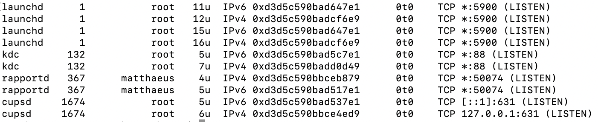
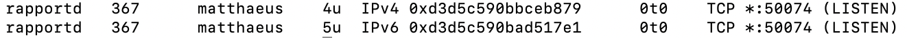
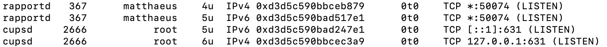

# Mac - Offene Ports / Firewall-Check

**Befehl 1:**
```bash
sudo lsof -i -P -n | grep LISTEN
```

**Ergebnis 1:**<br>
launchd: port 5900 (VNC)<br>
kdc: port 88 (Kerberos)<br>
rapportd: port 50074 (Apple Daemon)<br>
cupsd: port 631 (Print Daemon)<br>

**Screenshot 1:**<br>


**Kommentar 1:**<br>
VNC wird aktuell nicht benötigt im Homelab, die anderen Dienste haben Ihre Berechtigung.<br>
--> VNC Port wird in den Systemeinstellungen geschlossen um die Sicherheit zu erhöhen (Bildschirmfreigabe wird deaktiviert)

**Befehl 2:**
```bash
sudo lsof -i -P -n | grep LISTEN
```

**Screenshot 2:**<br>


**Kommentar 2:**<br>
Port 5900 (VNC) wurde erfolgreich geschlossen. Die Dienste kdc und cupsd wurden geschlossen. Da Kerberos z.B. für AD-Authentifikation verwendet wird sehe ich keinen Bedarf für den Dienst, habe ihn aber zur Sicherheit nicht entfernt. Der Druckdienst wird aber benötigt und mache einen Doublecheck indem ich im Firefox das Druckmenü öffne und schaue ob er wieder kommt.

**Screenshot 3:**<br>


**Kommentar 3:**<br>
Der cupsd Dienst ist wieder da, alles in Ordnung.


